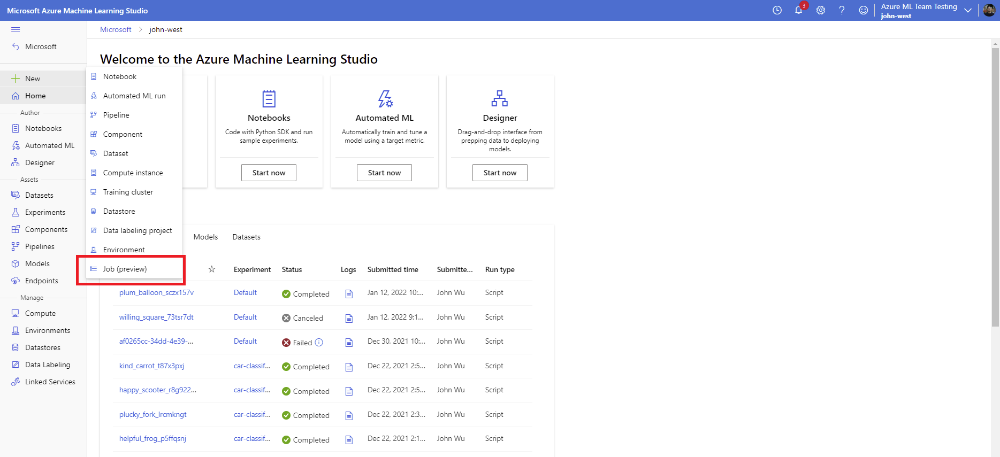
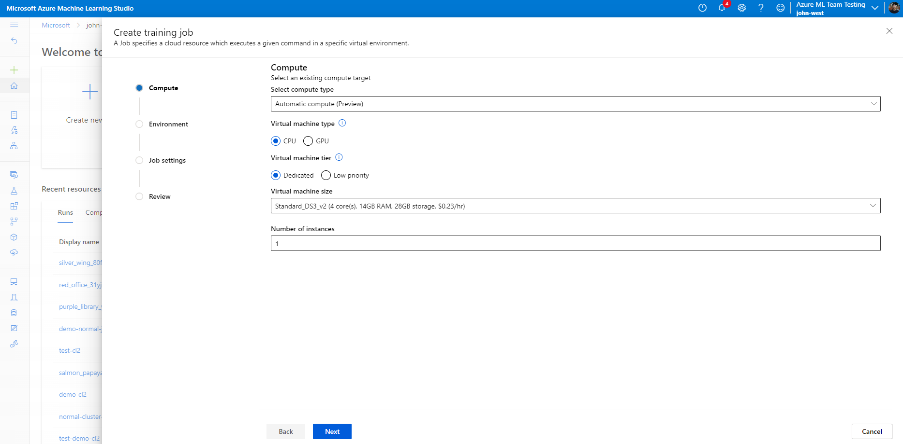
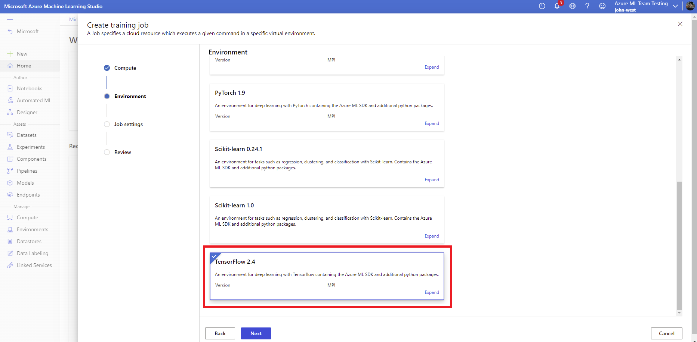
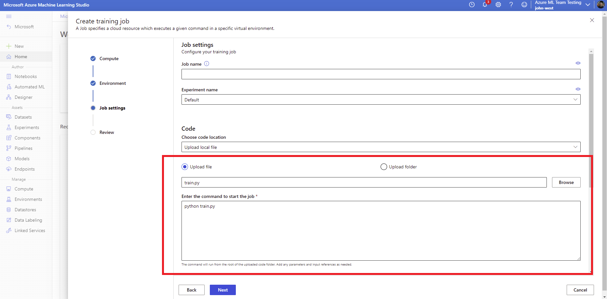
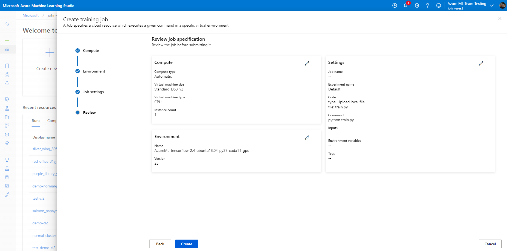
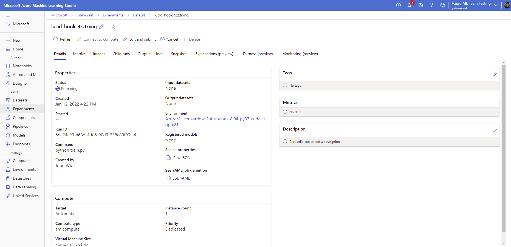
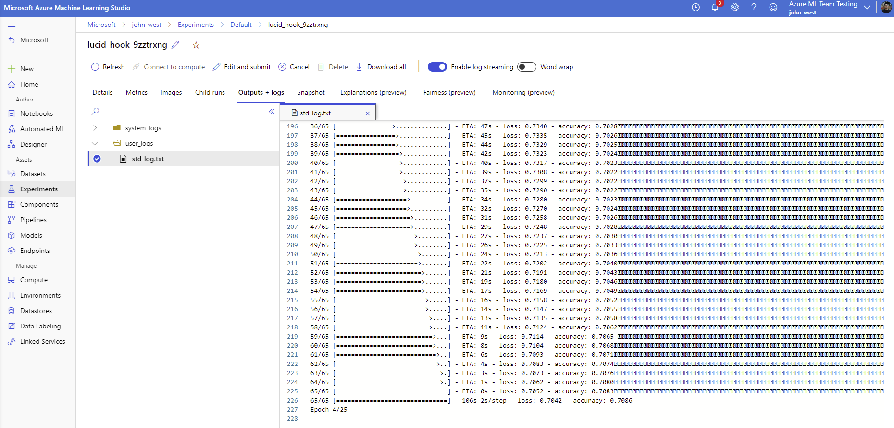
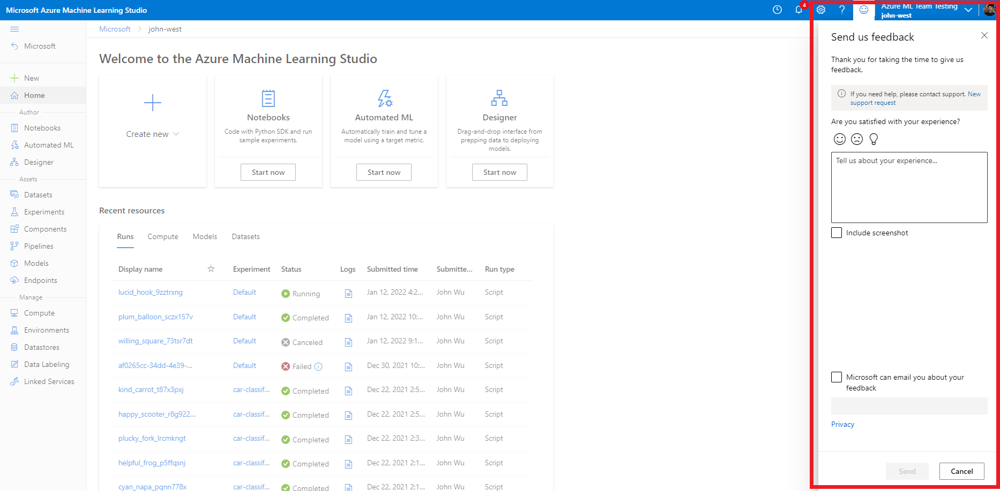

# [Private Preview] Azure ML automatic compute

## Overview

Azure ML automatic compute is a private preview feature that enables the submission of training jobs without having to create a compute target. Users can specify their compute requirements directly at job submission time and Azure ML will scale-up/scale-down the appropriate resources required for running the job. This feature is only available for command jobs during private preview. Support for other job types will be added at public preview.

This feature is currently enabled for all internal users at Microsoft. For external users looking to join the private preview, please fill out this [form](https://forms.office.com/r/L3Qz4s9UkB).

## How to use the feature

For your convenience, this repository includes a [training script](./src/train.py) that can be used as an example to run the job. The examples below will assume you are using the sample training script. If using your own code, make sure to fill out the relevant parameters accordingly based on your scenario.

## Using Azure ML Studio UI

1. Navigate to the <a href="https://ml.azure.com/" target="_blank">Azure ML Studio UI</a>. Then, on the top left corner, click `+ New`, followed by `Job (preview)`.



2. Make sure that `Automatic (Preview)` is selected as the compute type. Select your compute requirements and click `Next`.



3. Select the `TensorFlow 2.4` environment and click `Next`



4. Upload the attached `train.py` file, enter `python train.py` as the start command, and click `Next`.



5. Review your settings and click `Create`



6. Wait for the job to prepare. This may take a couple minutes if a job has not been submitted for awhile.



7. Once the job starts, you should be able to see metrics, logs, and monitoring information like with any other Azure ML job.



## Using ML extension on Azure CLI

1. Follow the instructions [here](https://docs.microsoft.com/azure/machine-learning/how-to-configure-cli) to install or update your Azure CLI and the ML extension to the latest versions.

2. Create a `job.yml` file with the following configuration. The `instance_type` and `instance_count` parameters can be changed to the selection of your choice. 

```yaml
$schema: https://azuremlschemas.azureedge.net/latest/commandJob.schema.json
experiment_name: automatic-compute
code:
  local_path: ./src
command: python train.py
environment: azureml:AzureML-tensorflow-2.4-ubuntu18.04-py37-cuda11-gpu:24
compute: None
resources:
  instance_count: 1
  instance_type: Standard_NC6
  properties:
    ComputeSpecification:
      Automatic: true
```

3. Run the job using the following command:

```
az ml job create --file job.yml
```

## How to submit feedback

To submit feedback, please use the built-in feedback tool in the Azure ML Studio UI.

