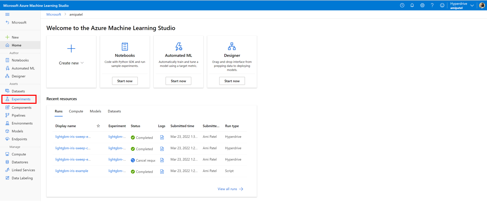
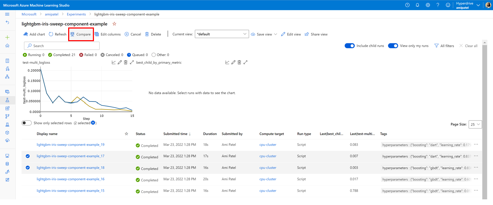
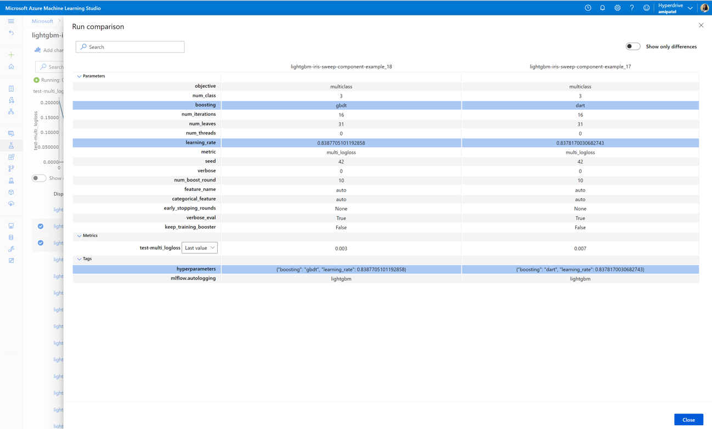
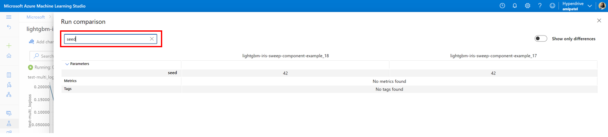
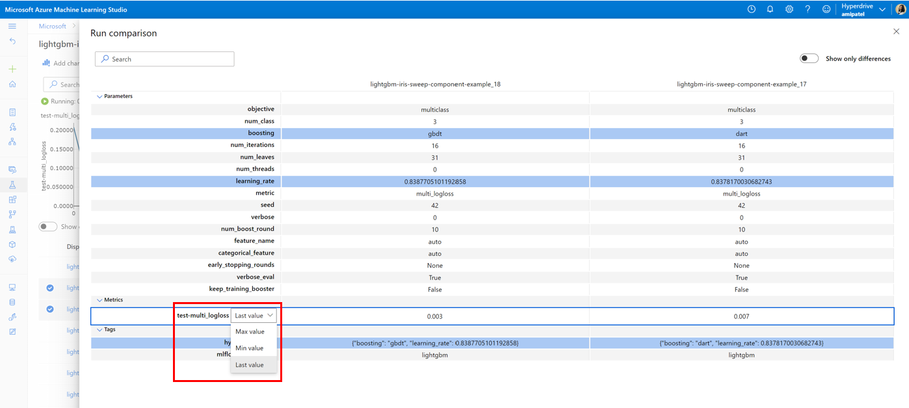
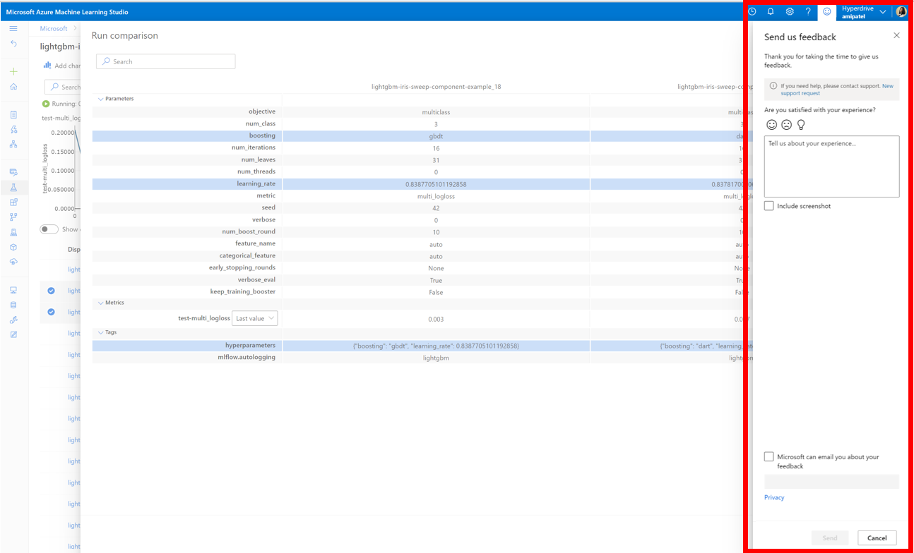

# [Private Preview] Compare Runs

## Overview 

Users can now compare more than one run in the run list view to view differences in parameters, metrics, and tags. 
This feature is currently enabled for all internal users at Microsoft. For external users looking to join the private preview, please fill out this [form](https://forms.office.com/r/KkZtVUxgmv).

## How to use the feature

1. Navigate to the <a href="https://ml.azure.com/" target="_blank">Azure ML Studio UI</a>. Then, using the left navigation, click `Experiments`.

2. Choose the experiment that contains the runs you would like to compare or if the runs are across different expeirments select the `All runs tab`.

3. Select more than one run that you would like to compare (up to 10) and click `Compare` at the top.

- Use the `show diff` toggle to display only rows with differing values.

- Use the search bar at the top to search for a specific parameter, metric, or tag.

- Choose which list metric aggregation (max,min,last), you would like to see in the comparison by directly clicking on the metric name. 

## How to submit feedback

To submit feedback, please use the built-in feedback tool in the Azure ML Studio UI.

