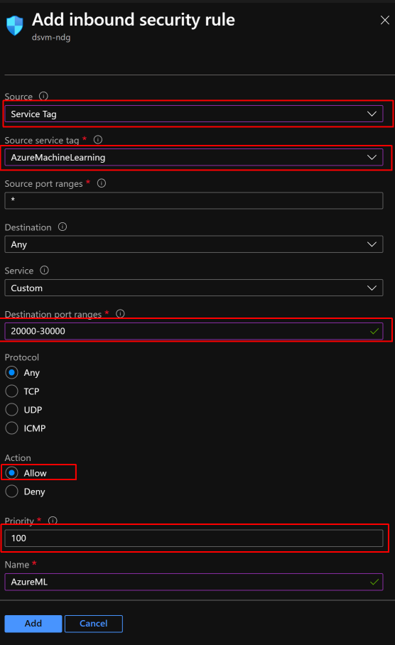
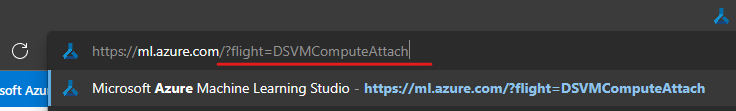
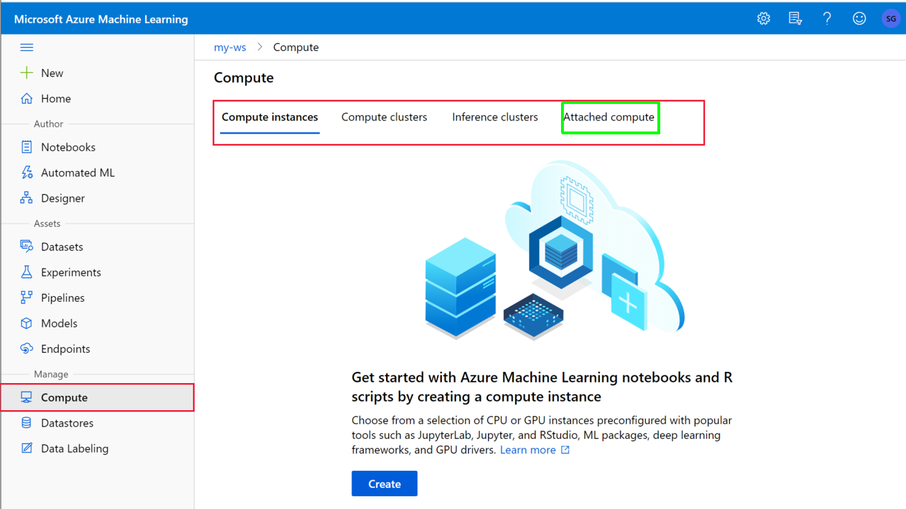
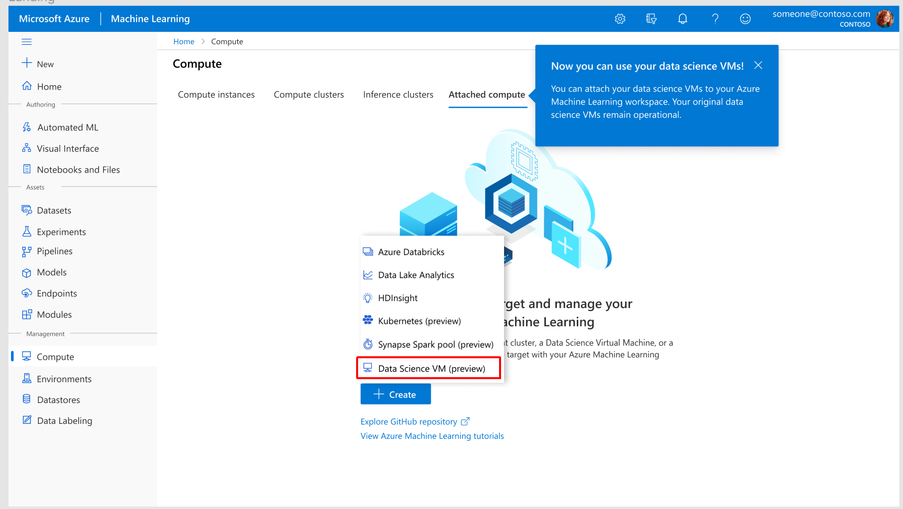
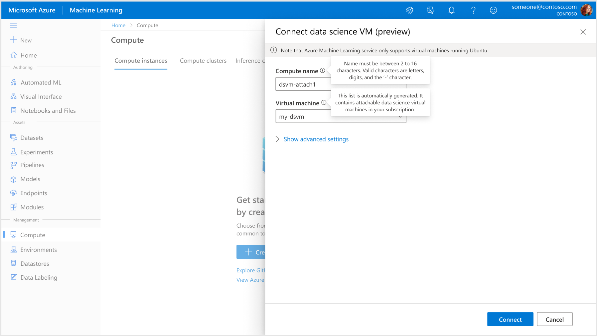
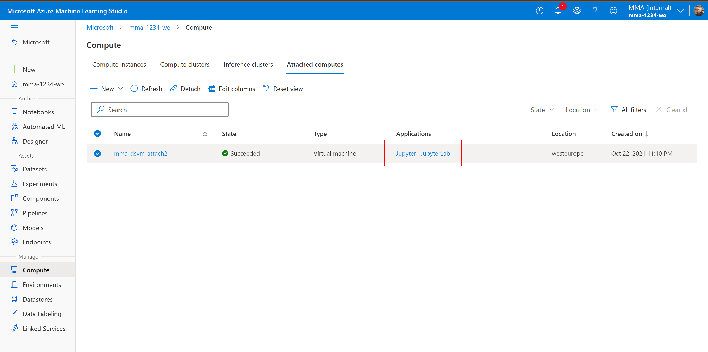
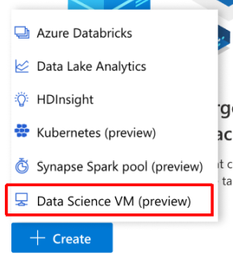

# Attach Data Science VM to Azure Machine Learning Workspaces (Preview)

## Overview
Data Science Virtual Machine (DSVM) is an unmanaged machine learning workstation. DSVM is recomended for individual data scientists that need a friction-free, pre-configured data science environment since it comes pre-configured and up-to-date ML packages, deep learning frameworks and GPU drivers.

During private preview you can attach DSVM to Azure ML so that existing DSVM users can get value-add features and an easier on-ramp to Azure ML.  

Preview features:

* **Single Sign-on to Jupyter/JupyterLab - no need to use any account and extra password, your AAD credentials will be reused**

* **Ease of access to resource from Azure Machine Learning - e.g. access to Workspace, track experiments, model deployment, etc.**

* **Maintain the customization available in VMs - ideal for users that need a lot of control over their environment**

* **Keep using DSVM - you don't loose access to your VM**

Roadmap:

* Automatic upgrades of VM Environment (SW / packages)

* Mounted hosted Azure Machine Learning datastores

## Prerequisites
- Azure ML Workspace -  - if you don't have any please find simple instruction [here](https://docs.microsoft.com/en-us/azure/machine-learning/quickstart-create-resources#create-the-workspace)
- Azure Data Science VM (DSVM) based on Ubuntu (*)- if you don't have any please find simple instructions [here](https://docs.microsoft.com/en-us/azure/machine-learning/data-science-virtual-machine/dsvm-ubuntu-intro)

> Note (*): at this point only Ubuntu based DSVM are supported. Currently only Ubuntu 18.04 is supported.

## Get started
These few steps guides you through the preparation and the DSVM attach procedure. Note that this feature is still in Private Preview so your Azure Subscription needs to be added to "approve list". You can sign in for the Private Preview [here](https://forms.office.com/r/0xDtY5YzcY).

### Step 1. Configure DSVM firewall
This step is needed since the Azure ML service needs to have access to the DSVM (for accessing Jupyter noteboks)

1. Go to your DSVM in  [Azure Portal](https://porta.azure.com)

1. Go to Firewall settings and allow inbound connection to service tag `AzureMachineLearning` and for ports `20000-30000` (see below) 

|Parameter|Value|
|------|-----|
|Source|Service Tag|
|Source service tag| AzureMachineLearning|
|Source port ranges| * (any)|
|Destination| Any|
|Service|Custom|
|Destination port ranges| 20000-30000|
|Protocol|Any|
|Action|Allow|
|Priority| something low enough to apply, e.g. 1001|
|Name| name your rule, e.g. AzureML|

> Note: when setting priority for this rule make sure the priority is high enough (lower number ~ higher priority) to overrule other restriction that might be present on your NSGs

### Steo 2. Attach your DSVM to AML Workspace
Now you have everything prepared and can attach your DSVM:

1. Go to [Azure Machine Learning studio](https://ml.azure.com/&flight=DSVMComputeAttach) note the url is `https://ml.azure.com/?flight=DSVMComputeAttach` and select your workspace

> **Important**: enable the Private Preview by adding a parameter `flight=DSVMComputeAttach` at the end of the URL in your browser 
> 

1. Select Compute and then Attached Compute 

1. Create new (attched compute - the following screen may vary whether you have already attached compute before) 

1. Name your compute (this name appears in AML Studio) and select your DSVM from your Subscription (dropdown list) and hist "Attach" button (this operation can tak minute or two) 

1. After a while (up to 3 minutes) you should see your DSVM to be succesfully attached and also can access your application (Jupyter) via link on the compute row or in the attached compute detail page  

> Note: for the Preview only Jupyter and JupyterLab links are working/visible

## Next Steps

You can now work using Jupyter with SSO - try [this tutorial](./docs/attach-dsvm-and-run-simple-notebook.md).

## Known Issues

- I cannot connect to Jupyter/JupyterLab -> make sure your firewall rules are setup correctly
- I cannot see my previously created content (files, notebooks, etc.) on DSVM when I attach and connect trough Jupyter -> your home folder needs to be linked, e.g. `sudo mount --bind /home/<dsvmuser> /home/<attach-user-name>/`
- I cannot see the option to attach "Data Science VM (Preview)" (as below), instead I see attach normal VM -> make sure you have enabled the flight parameter in the URL (see Step 2 first item)  

## Contact Us
Reach out to us: mimarusa@microsoft.com if you have any questions or feedback.