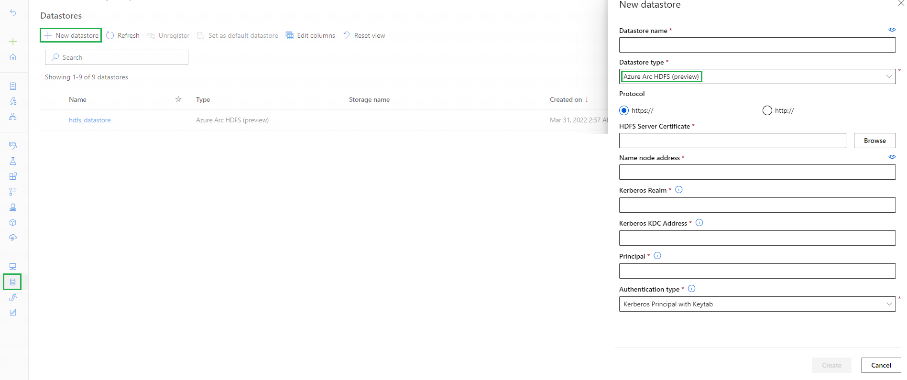

# Connect Hdfs data source in Azure Machine Learning (private preview)

## Overview

This document outlines how to use Hdfs data sources in Azure Machine Learning (ML) with Kubernetes compute targets.

## Prerequisites

* Please fill out [this form](https://forms.office.com/r/xd0tzYSDEE) to join the private preview.
* Azure subscription. If you don't have an Azure subscription, sign up to try the [free or paid version of Azure Machine Learning](https://azure.microsoft.com/free/) today.
* An Azure ML compute target of type Kubernetes from which the Hdfs cluster can be reached.

## Installation and setup

You must install the Azure ML SDK v1, version greater or equal to 1.40.0:
```bash
pip install --upgrade azureml-sdk>=1.40.0
```

## Register an Hdfs datastore

An Hdfs datastore contains the metadata information needed to connect to the underlying Hdfs cluster.  Like other data stores in Azure ML, it needs to be registered once
for it to be used in future training workloads.

### Python SDK v1

The following example creates a new Hdfs data store using the Python SDK:

```python
from azureml.core import Datastore, Workspace

workspace = Workspace.from_config()

datastore = Datastore.register_hdfs(
    workspace = workspace,
    datastore_name = "hdfs_datastore",
    protocol = "https",
    namenode_address = "namenode.my.hdfs.cluster.io:9000",
    hdfs_server_certificate = "./files/hdfs-namenode.crt",
    kerberos_realm = "MY.HDFS.CLUSTER.IO",
    kerberos_kdc_address = "krb5.my.hdfs.cluster.io",
    kerberos_principal = "amlprincipal",
    kerberos_keytab = "./files/amlprincipal.keytab",
    kerberos_password = None,
    overwrite = True
)
```

Detailed documentation of this API can be found in the [Azure documentation](https://docs.microsoft.com/en-us/python/api/azureml-core/azureml.core.datastore.datastore?view=azure-ml-py#azureml-core-datastore-datastore-register-hdfs).

### Register via the Azure ML Portal UI

As an alternative to using the Python SDK v1, data stores can also be registered via the Azure ML Portal UI.  The below screenshot highlights the following steps:
1. Navigate to the Datastores view by using the menu items on the left.
2. Click on "New datastore".
3. Select the Hdfs (preview) datastore type from the dropdown menu.
4. Fill in the other properties, equivalent to the SDK experience.



### Hdfs data store properties

All properties are described in the above documentation link.  However, we'd like to highlight a few details:
* `protocol`: can be 'http' or 'https'.  We strongly recommend using 'https' outside of test setups.
* `namenode_address`: you must ensure that the address can be reached from where the data will be accessed (i.e. the compute target to which training workloads are submitted)
* `hdfs_server_certificate`: if the namenode's certificate is not trusted by the container image used by the training workloads, you can optionally specify a local path to a pem certificate file for the namenode.  This parameter can be set to `None`
  if the protocol is 'http' or the certificate is trusted.
* `kerberos_kdc_address`: like the namenode's address, the compute target must be able to connect to the KDC.
* `kerberos_keytab` / `kerberos_password`: this parameter is mutually exclusive, but the keytab file must contain the login information for the principal in `kerberos_principal`. 

## Create and register a data set

### Python SDK v1

The above data store can be used as usual to create Dataset objects.  Below, we first create a local Dataset object and then register it in the Azure ML workspace.

```python
from azureml.core import Dataset

input_dataset = Dataset.File.from_files(path = [(datastore, '/user/hdfs')], validate = False)
        
input_dataset.register(
    workspace = workspace,
    name = 'hdfs_dataset',
    description = 'This is a Hdfs test dataset.',
    tags = None,
)
```

Note that if you set the `validate` parameter to true, the SDK will attempt to access the underlying data.  This will only work if the environment running this code has network access to the Hdfs cluster.

## Define an output and submit a job

### Training environment dependencies

To use Hdfs data stores, the container image must have the following dependencies installed:
* curl
* fuse
* krb5-user

Please take a look at [this Dockerfile](./samples/files/Dockerfile) for an example.  It is used in the [submit_job_input_output_sdk_v1.py](./samples/submit_job_input_output_sdk_v1.py) sample.

### Python SDK v1

The following code first defines an output destination and then passes it as an argument to a training job:

```python
from azureml.data import OutputFileDatasetConfig
output_dataset = OutputFileDatasetConfig(destination = (datastore, '/user/hdfs/my_output'))

from azureml.core import ComputeTarget
# This assumes the existence of a Kubernetes compute named 'amlarc' in the workspace
compute = ComputeTarget(workspace, 'amlarc')

# Environment with all dependencies installed
env = Environment(name='hdfs-env')
env.docker.base_image = 'dockerregistry/imagename:version'
env.python.user_managed_dependencies = True

from azureml.core import ScriptRunConfig
script_run_config = ScriptRunConfig(
    source_directory = 'files',
    script = 'test_script.py',
    arguments = [
        '--read-path',
        input_dataset.as_mount(),
        '--write-path',
        output_dataset.as_mount()
    ],
    compute_target = compute,
    environment = env
)
```

In `test_script.py`, the inputs and outputs can be accessed as follows:

```python
import argparse

if __name__ == '__main__':
    parser = argparse.ArgumentParser()
    parser.add_argument('--read-path', help = 'Path to input dataset')
    parser.add_argument('--write-path', help = 'Path to output dataset')
    args = parser.parse_args()

    print(args.read_path)
    print(args.write_path)
```

Here, `read_path` and `write_path` can be used to interact with the data.


## Troubleshooting

### Network connectivity

Your HDFS nodes as well as Kerberos KDC servers must be reachable from the Kubernetes cluster nodes configured as your AML Arc compute target. To validate this requirement
follow these steps:

* SSH to any of your Kubernetes cluster nodes for your AML Arc compute target;

* Check connectivity to Kerberos KDC:
```bash
nc -v <kdc_address> <kdc_port>              # KDC typically uses ports 88 or 750 (this can also be found in /etc/krb5kdc/kdc.conf file on your KDC server)
```

* Check connectivity to HDFS nodes:
```bash
nc -v <namenode_adddress> <hdfs_port>   # Contact your HDFS admin for details about HDFS ports
nc -v <datanodes_adddress> <hdfs_port>   # Contact your HDFS admin for details about HDFS ports
```

* DNS reverse lookup:

Verify that both the KDC and HDFS fully qualified domain names (FQDN) can be reverse-looked up from their IP address.

```bash
host <hdfs_namenode_IP>

host <kcd_IP>
```

Note: if your Kubernetes cluster nodes have a `/etc/hosts` file with entries for HDFS or KDC hostnames, check those values instead. Ensure no duplicate entries are present that map different hostnames to IP addresses of your HDFS and KDC servers.


## Next steps

Please take a look at the code samples provided in the [samples](./samples) directory.  We're looking forward your feedback!
