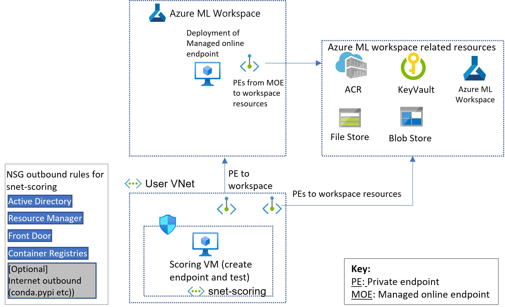

# Network isolation support for managed online endpoints

Our enterprise customers want to ensure their ML deployments are secure. With this preview we are enabling the following scenarios. 
1. Secure ingress via workspace Private Endpoint (PE) support: Once you deploy a model, the model serving endpoint (scoring_uri) can be configured to be accessed only from a private IP from your vnet. i.e. you will be able to use your Azure ML workspace Private Endpoint to access the scoring_uri of the managed online endpoint.
2. Secure egress via PEs to workspace resources: Egress from the scoring model container will be restricted only to specific resources via secure conectivity through PEs. Internet access is disabled.

Key benefits to the users are:
1. Secure connectivity helps with Data Exfiltration Protection.
2. No additional configuration is needed in user's VNET/NSG.

## Control plane vs data plane operations
In summary, scope of the the capablities described in this document is regarding the endpoints **data plane** operations. Details are explained below.

Azure operations can be divided into two categories - [control plane and data plane](https://docs.microsoft.com/en-us/azure/azure-resource-manager/management/control-plane-and-data-plane). 

### Control plane
You use the control plane operations to manage resources in your subscription. All requests for control plane operations are sent to the Azure Resource Manager URL. The endpoint control plane operations include create, update, delete etc. All operations through CLI V2/ARM/REST fall under this category (for e.g. in case of online deployments, get-logs uses ARM). More information [here](https://docs.microsoft.com/en-us/azure/machine-learning/how-to-manage-workspace-cli?tabs=vnetpleconfigurationsv2cli%2Ccreatenewresources%2Cworkspaceupdatev1%2Cworkspacesynckeysv1%2Cworkspacedeletev1#secure-cli-communications). To secure the control plane operations, you have to 
1. Setup [ARM private link (preview)](https://docs.microsoft.com/en-us/azure/azure-resource-manager/management/create-private-link-access-portal). Please be aware of the [limitations](https://docs.microsoft.com/en-us/azure/azure-resource-manager/management/create-private-link-access-portal#understand-architecture).
1. Set the workspace flag `public_network_access` to `disabled`

__Note__: Currently ARM private link preview can be enabled only at tenant level. However you can skip this if your requirement is to secure the data plane (explained below).

### Data plane
The only data plane operation is to invoke/score your endpoint. Focus of rest of this document is to explain how to setup network isolation for this usecase flow.
__This setup is independent of the control plane security configuration__. i.e. even if you choose not configure the above control plane security steps, you can fully configure data plane security.

## Concept


### Secure the ingress (private preview)
Endpoint visibility will be determined if there is a PE assoiciated with the workspace. Incase there is a PE, then endpoint visibility will be private. If there is no PE then the visiblity be public.

### Secure the ingress (upcoming public preview)
__Note:__ This is a heads up for public preview. Will not work with private preview yet.

The goal here is to secure the model serving endpoint (scoring_uri) so that it can accessed only from a private IP from your vnet via a private endpoint. To secure the ingress, configure the following:
1. [Setup a PE to the ML workspace](https://docs.microsoft.com/en-us/azure/machine-learning/how-to-configure-private-link?tabs=azurecliextensionv2).
2. Visibility of the scoring endpoint is governed by an endpoint flag `public_network_access`.  If it is `disabled` then scoring endpoints can be accessed only from VNETs that have PEs to the workspace. If it is `enabled`, the scoring endpoint can be accessed both from the PEs and public networks.
```bash
az ml online-endpoint create -f endpoint.yml --set public_network_access=disabled
```

### Secure the egress
With secure egress support, PE's are created from the managed endpoint deployment to workspace resources including ACR, KeyValut, Workspace, Filestore & Blob store. Internet access is not permitted. 

When you create managed online deployments you have the option of setting a flag `private_network_connection` as `true`. Now all system communication will use the PEs (downloading model, code, images etc to the container). Any user logic leveraging these resources will also use the PEs. No additional configuration in user’s vnet are required.

This is the syntax to create a managed online deployment with secure egress.
```bash
az ml online-deployment create -f deployment.yml --set private_network_connection true
```

Creation and deletion of PEs to workspace resources are handled transparently along with the deployment.

Visibility of the scoring endpoint is governed by the [workspace flag `public_network_access`](https://docs.microsoft.com/en-us/azure/machine-learning/how-to-configure-private-link?tabs=azurecliextensionv2#enable-public-access). If it is `disabled` then scoring endpoints can be accessed only from VNETs that have PEs to the workspace. If it is enabled, the scoring endpoints can be accessed both from the PEs and public networks.

__Note__: During this preview private endpoints to workspace resources are created per deployment - not per workspace as shown in the above diagram

### Supported scenarios (upcoming public preview)

| Scenario | Ingress mode (endpoint property) | Egress mode (Deployment property) | Supported? |
| -------- | -------------------------------- | --------------------------------- | --------- |
| secure ingress with secure egress | `public_network_access` is disabled | `private_network_connection` is true   | Yes |
| secure ingress with public egress | `public_network_access` is dsiabled | `private_network_connection` is false  | Yes |
| public ingress with secure egress | `public_network_access` is enabled | `private_network_connection` is true    | Yes |
| public ingress with public egress | `public_network_access` is enabled | `private_network_connection` is false  | Yes |

__Warning:__
If workspace flag `public_network_access` is `disabled`:
1. only private deployments will be allowed to be created (i.e. deployments with `private_network_connection` is `true`).
1. if it gets disabled for a workspace with existing public managed endpoints, then the public deployments will start failing.

### ARM contract (upcoming public preview)

Endpoint flag for public network access
```json
"properties": {
        "publicNetworkAccess": "Enabled"
}
```
The flag can take the values Enabled or Disabled.

Deployment flag for private network connection
```json
"properties": {
        "privateNetworkConnection": "True"
}
```
The flag can take the values True or False

## End to end example
### Step 1: Prerequisites
* This private preview is by __invite only__ at this time. The subscription id and tenant id needs to be added to our allow-list.
* Install and configure the Azure CLI and the ml extension to the Azure CLI. For more information, see [Install, set up, and use the CLI (v2) (preview)](https://docs.microsoft.com/en-us/azure/machine-learning/how-to-configure-cli). 
* You must have an Azure resource group, and you (or the service principal you use) must have Contributor access to it. A resource group is created in [Install, set up, and use the CLI (v2) (preview)](https://docs.microsoft.com/en-us/azure/machine-learning/how-to-configure-cli).
* If you haven't already set the defaults for the Azure CLI, save your default settings. To avoid passing in the values for your subscription and resource group multiple times, run this code:
    ```bash
    az account set --subscription <subscription ID>
    az configure --defaults group=<resource group>
    ```
* Configure to access private preview feature from CLI:

    To activate the private feature enable it through environment variable (bash):
    ```bash
    export AZURE_ML_CLI_PRIVATE_FEATURES_ENABLED=true
    ```
    for powershell:
    ```
    $Env:AZURE_ML_CLI_PRIVATE_FEATURES_ENABLED=$true
    ```
     To deactivate either set the value to false or delete the environment variable.
* ACR needs to be premium SKU. If you use the below workspace setup script, this will be handled.

### Prepare your system
Clone the azureml-examples repo and navigate to the working folder.
```bash
git clone --branch rsethur/mvnet https://github.com/Azure/azureml-examples
cd azureml-examples/cli
```
   

### Step 2: Create workspace and secured resources setup
If you have your own workspace and secure resources setup, you could use that. Alternatively the below template will create the complete setup required for testing this feature:

```bash
# SUFFIX will be used as resource name suffix in created workspace and related resources
export SUFFIX="<UNIQUE_SUFFIX>"
# This bicep template sets up secure workspace and relevant resources
az deployment group create --template-file endpoints/online/managed/vnet/setup_ws/main.bicep --parameters suffix=$SUFFIX--parameters suffix=$SUFFIX
```
The following resources will be created:
1. Azure ML workspace with public_network_access as enabled
2. ACR, storage and keyvault with public access disabled
3. A user vnet that will be used for scoring. Private endpoints will be created from this VNET to the above resources: Azure ML workspace, ACR, Keyvault, File and Blob stores.
4. A scoring subnet (snet-scoring) will be created with the outbound NSG rules as shown in the above picture. Internet outbound is enabled to get access to anaconda/pypi, get access to azureml-examples repo and download azure cli. You can disable it based on your needs.

Review the bicep template if you would like to understand more details.

The following resources will be created by you in the following steps:
1. Scoring VM
2. Managed endpoint 


Note: If you are not using the above template, then create private endpoint from your vnet to azure ml workspace using instructions [here]((https://docs.microsoft.com/en-us/azure/machine-learning/how-to-configure-private-link?tabs=azurecliextensionv2))

### Step 3: Setup a VM inside the vnet
We need to create a VM in the scoring subnet (snet-scoring), inorder to create and test a managed endpoint from within your vnet. 

```bash
# create vm
az vm create --name test-vm --vnet-name vnet-$SUFFIX --subnet snet-scoring --image UbuntuLTS --admin-username azureuser --admin-password <your-new-password>
# ssh into the vm: use the publicIpAddress that is output from the above steo
ssh azureuser@<vm_public_ip>
```
Note: the above script creates a VM with public IP for sake of simplfying this example. If you want a more secure VM setup, please go through [`az vm create` docs](https://docs.microsoft.com/en-us/cli/azure/vm?view=azure-cli-latest#az-vm-create). Basic vm creation tutorial is [here](https://docs.microsoft.com/en-us/azure/virtual-machines/linux/quick-create-cli)

Note: Execute rest of the steps from the SSH connection to the VM.

Setup the VM
```bash
# setup docker
sudo apt-get update -y && sudo apt install docker.io -y && sudo snap install docker && docker --version && sudo usermod -aG docker $USER
# setup az cli and ml extension
curl -sL https://aka.ms/InstallAzureCLIDeb | sudo bash && az extension add --upgrade -n ml -y
```

Setup environment variables
```bash
export SUBSCRIPTION="<YOUR_SUBSCRIPTION_ID>"
export RESOURCE_GROUP="<YOUR_RESOURCE_GROUP>"
export LOCATION="<LOCATION>"

# SUFFIX that was used when creating the workspace resources. Alternatively the resource names can be looked up from the resource group after the vnet setup script has completed.
export SUFFIX="<SUFFIX_USED_IN_SETUP>"

# SUFFIX used during the initial setup. Alternatively the resource names can be looked up from the resource group after the  setup script has completed.
export WORKSPACE=mlw-$SUFFIX
export ACR_NAME=cr$SUFFIX

# provide a unique name for the endpoint
export ENDPOINT_NAME="<YOUR_ENDPOINT_NAME>"

# name of the image that will be built for this sample and pushed into acr - no need to change this
export IMAGE_NAME="img"

# Yaml files that will be used to create endpoint and deployment. These are relative to azureml-examples/cli/ directory. Do not change these
export ENDPOINT_FILE_PATH="endpoints/online/managed/vnet/sample/endpoint.yml"
export DEPLOYMENT_FILE_PATH="endpoints/online/managed/vnet/sample/blue-deployment-vnet.yml"
export SAMPLE_REQUEST_PATH="endpoints/online/managed/vnet/sample/sample-request.json"
export ENV_DIR_PATH="endpoints/online/managed/vnet/sample/environment"
```

Login using az cli. Alternatively you can use [service principal based authentication](https://docs.microsoft.com/en-us/cli/azure/authenticate-azure-cli#sign-in-with-a-service-principal).
```bash
# Login using az cli. This will ask you to sign in using the browser.
az login
```

Configure CLI defaults
```bash
az account set --subscription $SUBSCRIPTION
az configure --defaults group=$RESOURCE_GROUP workspace=$WORKSPACE location=$LOCATION
```

Clone the azureml-examples repo again - but inside the VM now. This is needed to build the image and create the managed online deployment.
```bash
sudo mkdir -p /home/samples; sudo git clone --branch rsethur/mvnet --depth 1 https://github.com/Azure/azureml-examples.git /home/samples/azureml-examples -q
```

### Step 4: Build the docker image that will be used by the managed endpoint deployment
Since internet egress is not allowed, we need to have a fully built image in ACR.

```bash
# Navigate to the samples
cd /home/samples/azureml-examples/cli/$ENV_DIR_PATH
# login to acr. Optionally, to avoid using sudo, complete the docker post install steps: https://docs.docker.com/engine/install/linux-postinstall/
sudo az acr login -n $ACR_NAME
# Build the docker image with the sample docker file
sudo docker build -t $ACR_NAME.azurecr.io/repo/$IMAGE_NAME:v1 .
# push the image to the ACR
sudo docker push $ACR_NAME.azurecr.io/repo/$IMAGE_NAME:v1
# check if the image exists in acr
az acr repository show -n $ACR_NAME --repository repo/$IMAGE_NAME
```
As you will see in the next step, we will be using custom [container support](https://docs.microsoft.com/en-us/azure/machine-learning/how-to-deploy-custom-container), to deploy this custom built image into managed endpoints.

#### Alternate option
Alternatively, you can build the docker image in your vnet using azure ml compute cluster and azure ml environments. Instructions [here](https://docs.microsoft.com/en-us/azure/machine-learning/how-to-secure-workspace-vnet?tabs=pe%2Ccli#enable-azure-container-registry-acr).

### Step 5: Create managed online endpoint with secure ingress and deployment with secure egress
We will use the example [here](https://docs.microsoft.com/en-us/azure/machine-learning/how-to-deploy-managed-online-endpoints#deploy-to-azure) to create the endpoint and deployment

```bash
cd /home/samples/azureml-examples/cli/

# create endpoint
az ml online-endpoint create --name $ENDPOINT_NAME -f $ENDPOINT_FILE_PATH
# create deployment in managed vnet
az ml online-deployment create --name blue --endpoint $ENDPOINT_NAME -f $DEPLOYMENT_FILE_PATH --all-traffic --set environment.image="$ACR_NAME.azurecr.io/repo/$IMAGE_NAME:v1" private_network_connection="true"
```

Note the flags `--set public_network_access=disabled` in the endpoint creation and `--set private_network_connection=true` in the deployment creation.

Now you can test scoring using the `invoke` command from the cli or using curl
```bash
# Try scoring using the CLI
az ml online-endpoint invoke --name $ENDPOINT_NAME --request-file $SAMPLE_REQUEST_PATH

# Try scoring using curl
ENDPOINT_KEY=$(az ml online-endpoint get-credentials -n $ENDPOINT_NAME -o tsv --query primaryKey)
SCORING_URI=$(az ml online-endpoint show -n $ENDPOINT_NAME -o tsv --query scoring_uri)
curl --request POST "$SCORING_URI" --header "Authorization: Bearer $ENDPOINT_KEY" --header 'Content-Type: application/json' --data @$SAMPLE_REQUEST_PATH
```

